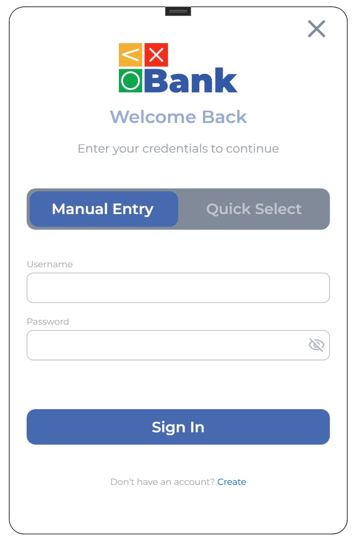
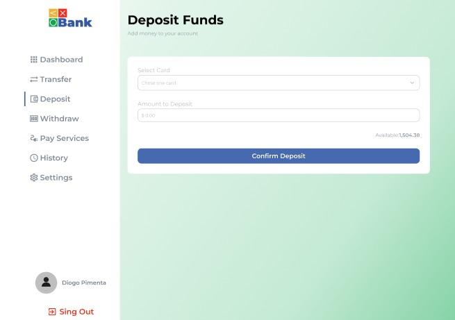
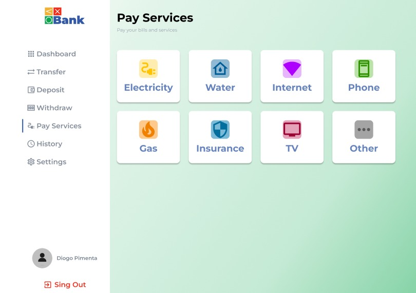

# Digital Wallet (Banking System)

A full-stack banking simulation built with **ASP.NET Core** and **WPF**, designed to replicate the core features of a modern digital banking system.

The project follows a **client–server architecture**, with a **REST API backend** and a **WPF desktop client**. It implements secure authentication, digital card management, and financial transactions.

Originally developed as an **Object-Oriented Programming project**, it was later restructured to follow **industry-standard practices and architecture patterns**.

---

# 🏗️ Architecture

The project uses a **Monorepo structure**, containing both the backend API and the desktop client.

```
WPF Desktop Client (MVVM)
        │
        │ HTTP Requests (JWT Authentication)
        ▼
ASP.NET Core Web API
        │
        ▼
PostgreSQL Database
(Entity Framework Core)
```

---

# 📦 Project Structure

## Frontend — `Frontend_WPF`

Desktop application built with **WPF (Windows Presentation Foundation)**.

### Architecture Pattern

- MVVM (Model–View–ViewModel)

This ensures a clean separation between:

- UI (Views)
- Presentation logic (ViewModels)
- Data models

### Status

Interface and client logic are mostly completed.

---

## Backend — `Backend_API`

RESTful API built with **ASP.NET Core**.

### Authentication

- Secure authentication using **JWT tokens**
- Protected endpoints using **Bearer authentication**

### Database

- PostgreSQL
- Entity Framework Core

### Status

API implemented and currently being tested and integrated with the WPF client.

---

# ✨ Features

### User Onboarding

- User registration
- Automatic creation of:
  - Bank account
  - Digital card
- Operations handled using **database transactions**

### Authentication & Security

- Secure login
- JWT token generation
- Protected API endpoints

### Card Management

- Users can view their digital cards
- Data isolation ensures users only access their own information

### Financial Transactions

Support for:

- Deposits
- Service payments
- Bank transfers

Transfers include **interbank transaction fees**.

---

# 💻 Tech Stack

## Backend

- **ASP.NET Core Web API**
- **Entity Framework Core**
- **PostgreSQL**
- **JWT Authentication**

## Frontend

- **WPF**
- **XAML**
- **MVVM Pattern**

## Language

- **C# (.NET)**

---

# ▶️ Running the Project

## Prerequisites

- .NET SDK
- PostgreSQL
- Visual Studio (recommended)

---

## Start the Backend

Navigate to the backend folder:

```bash
cd BackMultibanco
```

Apply database migrations:

```bash
dotnet ef database update
```

Start the API:

```bash
dotnet run
```

---

## Start the Frontend

1. Open the solution in **Visual Studio**
2. Set the **WPF project** as the **Startup Project**
3. Ensure the API URL matches the backend URL (example: `localhost:5000`)
4. Run the application

---

# 🎯 Project Goals

This project was created to practice and demonstrate:

- Building **REST APIs with ASP.NET Core**
- Implementing **secure authentication using JWT**
- Using **Entity Framework Core with PostgreSQL**
- Applying the **MVVM architecture in WPF**
- Connecting a **desktop client to a backend API**

---

# 📈 Next Steps

- Finish integrating API endpoints with WPF ViewModels
- Test authentication flows (login, registration, token storage)
- Improve network error handling in the WPF client
- Add unit tests

---

# 📷 Screenshots

### Login Screen


### Deposit Screen


### Pay Services Screen
